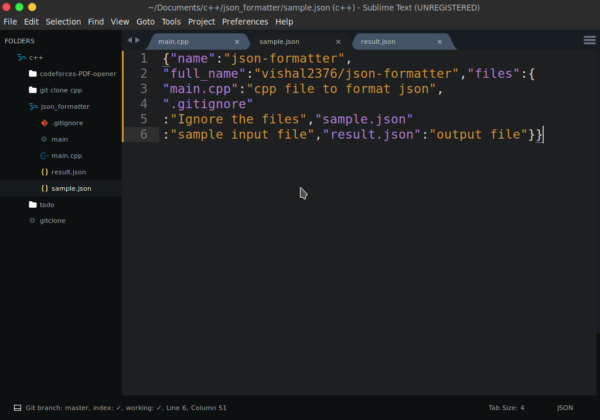
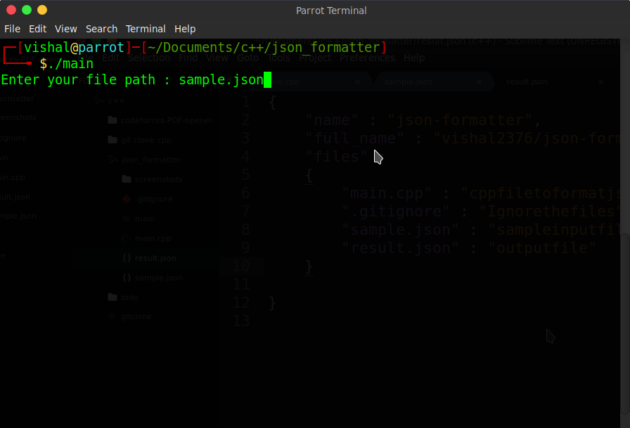
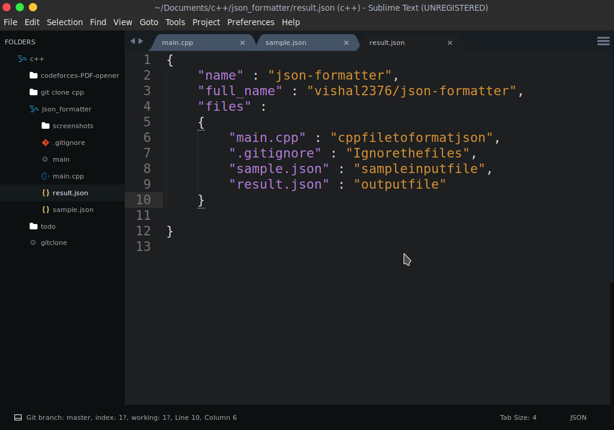

# Json Formatter

A simple tool to format json file and make it easy to read.

	
	
	

 

## Screeshots :

## More projects : 

 - [Virtual Assistant](https://github.com/vishal2376/virtual-assistant)
 - [C++ Mini Projects](https://github.com/vishal2376/cpp-mini-projects)
 - [Telegram Bot](https://github.com/vishal2376/telegram-bot)

## Contacts :  

 - [Instagram](https://www.instagram.com/vishal_2376/)
 - [Telegram](https://t.me/vishal2376/)
 - [Join Telegram group](https://t.me/cppwithtricks)